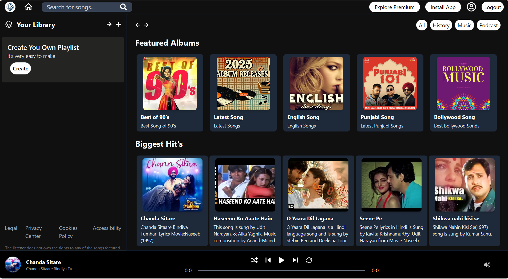
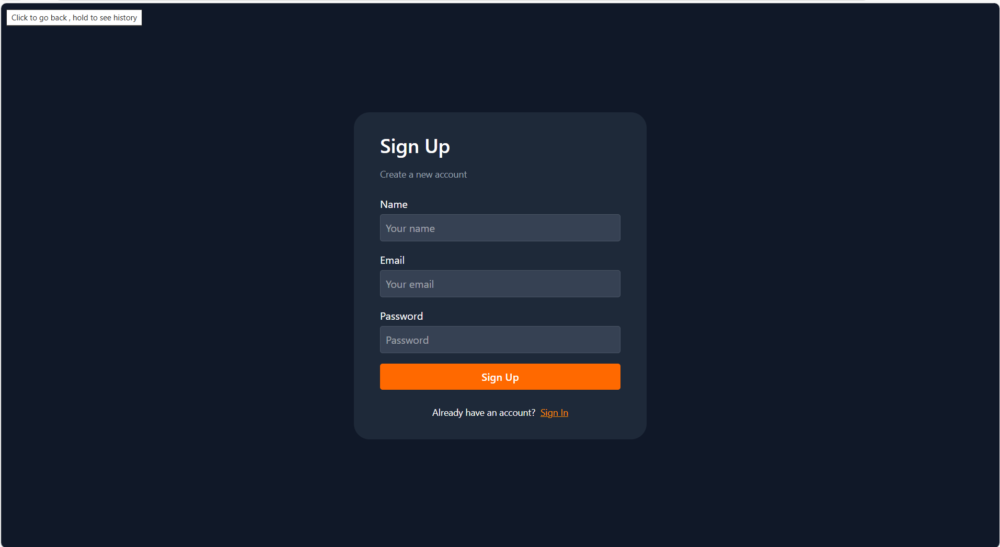
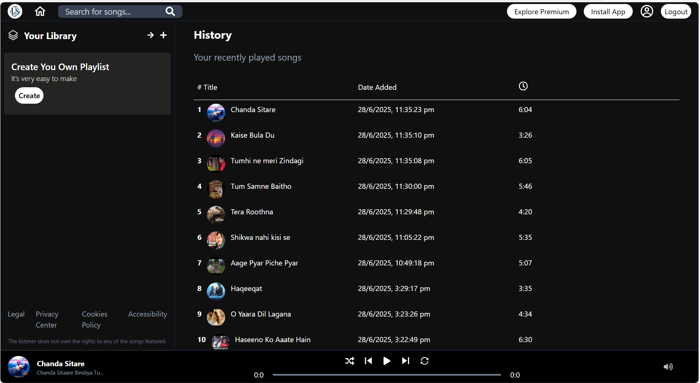
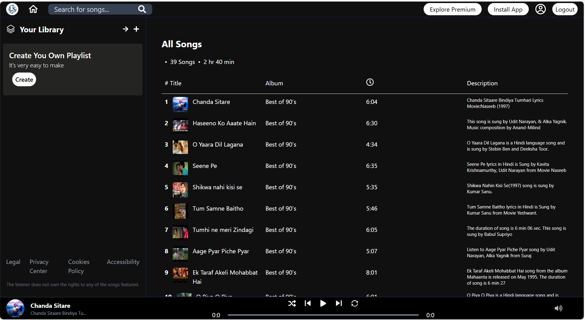
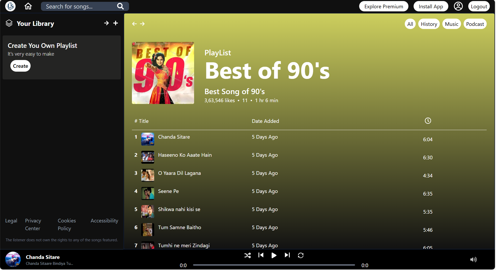
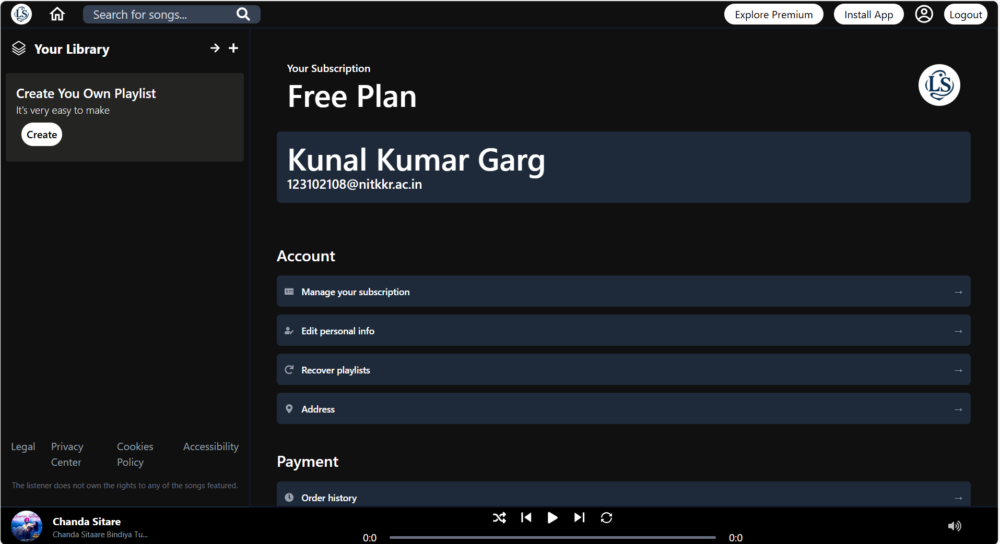
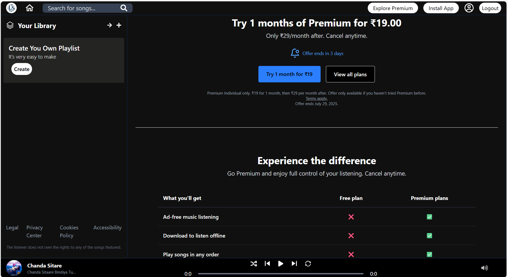
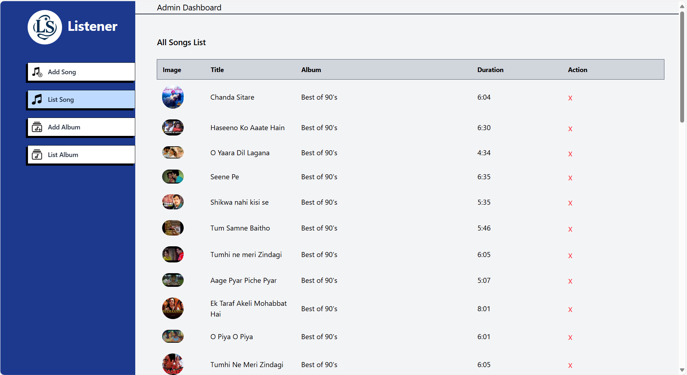
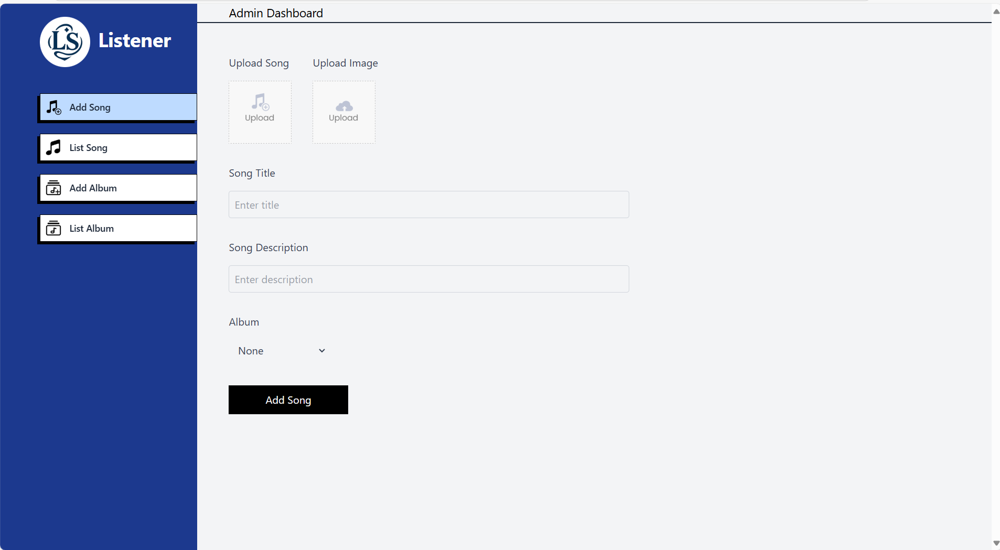

# 🎵 Listener (MERN Stack)
---
## Overview

#### **Listener** is a full-featured music streaming web application inspired by Spotify. Built using the **MERN** stack, it offers both a user-facing music player and an admin dashboard for managing songs and albums. The project supports secure authentication, music uploads, album management, and a seamless listening experience.

---

## ✨ Features
### 🎶 Frontend (User Side)
- Browse and play songs and albums.
- Seekbar, volume control, shuffle, and looping.
- **User authentication** with JWT and email verification.
- Profile page with user details.
- History page to view previously played songs.
- Responsive and clean UI.

### 🛠️ Admin Dashboard
- Add new songs and albums via form uploads.
- View and manage listed songs and albums.
- Upload images and audio files via Cloudinary.

### 📡 Backend
- Secure authentication using JWT.
- Password hashing with bcrypt.
- Email services via Nodemailer.
- File uploads handled with Multer and stored in Cloudinary.

---

## Screenshots
<div style="display: flex; flex-wrap: wrap; justify-content: center;">
    
  
  
  
  
  
  
  
  
</div>

---
## 📚 Tech Stack

### 🖥️ Frontend
- **React** `^19.1.0`
- **React Router DOM** `^7.6.2`
- **Tailwind CSS** `^4.1.10`
- **Axios** `^1.10.0`
- **React Toastify** `^11.0.5`
- **React Icons** `^5.5.0`
- **jwt-decode** `^4.0.0`

### ⚙️ Backend
- **Node.js** `^18+`
- **Express** `^5.1.0`
- **Mongoose** `^8.16.0`
- **bcryptjs** `^3.0.2`
- **jsonwebtoken** `^9.0.2`
- **dotenv** `^16.5.0`
- **cors** `^2.8.5`
- **multer** `^2.0.1`
- **nodemailer** `^7.0.3`
- **cloudinary** `^2.7.0`
- **nodemon** `^3.1.10`

 ---
 
##  Installation Guide 
### 1️⃣ Clone the Repository  
```sh
git clone https://github.com/Kunalgarg108/Listener.git
cd Listener
```

### 2️⃣ Install Dependencies  
```sh
npm install
```

### 3️⃣ Setup Firebase
- Go to Firebase Console
- Create a new project
- Enable Authentication > Sign-in Methods
- Enable Google Sign-In and Email/Password Sign-In
- Copy Firebase Config from Project Settings


### 4️⃣ Create .env File
Create a .env file in the root directory and add your Firebase credentials:
```sh
VITE_FIREBASE_API_KEY=your-api-key
VITE_FIREBASE_AUTH_DOMAIN=your-auth-domain
VITE_FIREBASE_PROJECT_ID=your-project-id
VITE_FIREBASE_STORAGE_BUCKET=your-storage-bucket
VITE_FIREBASE_MESSAGING_SENDER_ID=your-messaging-sender-id
VITE_FIREBASE_APP_ID=your-app-id
VITE_FIREBASE_MEASUREMENT_ID=your-measurement-id

```
### 5️⃣ Run the Project
```sh
npm run dev
```


---
## Folder Structure
```
Hype-Haven/
├── public/          # Static files and screenshots
├── src/             # Main source folder
│   ├── assets/      # Images, fonts, and other assets
│   ├── components/  # Reusable components
│   │   ├── BestSeller.jsx
│   │   ├── CardHome.jsx
│   │   ├── CartTotal.jsx
│   │   ├── Footer.jsx
│   │   ├── LatestCollection.jsx
│   │   ├── Navbar.jsx
│   │   ├── NewsLetterBox.jsx
│   │   ├── Policy.jsx
│   │   ├── ProductItem.jsx
│   │   ├── RelatedProduct.jsx
│   │   ├── SearchBar.jsx
│   │   ├── Title.jsx
│   ├── context/     # Context API files
│   │   ├── Shopcontext.jsx
│   ├── pages/       # Application pages
│   │   ├── About.jsx
│   │   ├── Cart.jsx
│   │   ├── Collection.jsx
│   │   ├── Contact.jsx
│   │   ├── Home.jsx
│   │   ├── Login.jsx
│   │   ├── Order.jsx
│   │   ├── Placeorder.jsx
│   │   ├── Product.jsx
│   ├── App.jsx      # Root app component
│   ├── firebase.js  # Firebase configuration
│   ├── index.css    # Global styles
│   ├── main.jsx     # Entry point for React
├── .env # Environment variables
├── index.html
├── tailwind.config.js

```
